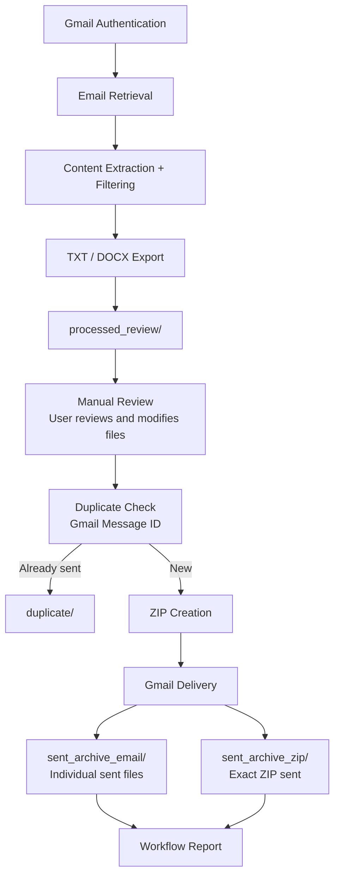

# Email Automation - Java Spring Boot


## Table of Contents

- [Email Automation - Java Spring Boot](#email-automation---java-spring-boot)
  - [Table of Contents](#table-of-contents)
  - [Overview](#overview)
  - [Project Documentation](#project-documentation)
  - [Workflow](#workflow)
  - [Technologies](#technologies)
  - [Current Status](#current-status)
    - [Completed](#completed)
    - [In Development](#in-development)
  - [Running Locally](#running-locally)
    - [Prerequisites](#prerequisites)
    - [Clone the Repository](#clone-the-repository)
    - [Build the Application](#build-the-application)
    - [Run the Application](#run-the-application)
    - [Verify the Application](#verify-the-application)
  - [Configuration](#configuration)
  - [API](#api)
  - [Project Direction](#project-direction)
  - [Documentation Source](#documentation-source)

---

## Overview

Email Automation is a Java Spring Boot application for processing recruiter and job opportunity emails through the Gmail API.

The project originated from a recruiter-email automation process that was first implemented in Python and reduced a manual workflow from approximately 12 hours to about 90 minutes.

The Java implementation was developed as a separate solution to achieve the same core processing outcomes using a different architecture and implementation approach. It uses Java 17, Spring Boot, REST APIs, separated services, DTOs, and OAuth2 Gmail integration.

The Java project is maintained as an independent application with its own architecture, source code, testing, configuration, and documentation. The core Java workflow is now implemented and runtime-validated, including export, manual review, duplicate prevention, ZIP creation, Gmail delivery, sent-file archiving, and workflow reporting.

---

## Project Documentation

A documentation website is included with the project for a more detailed walkthrough of the application.

It covers:

* project background and evolution from the original Python implementation
* application architecture
* end-to-end workflow
* engineering and implementation decisions
* REST API endpoints
* setup and local execution
* current development status
* project roadmap

The documentation website starts at:

```text
docs/index.html
```

When published through GitHub Pages, the same documentation can be viewed as a website directly from the repository's GitHub Pages URL.

The original Markdown documentation used as source material for the website is preserved under:

```text
docs/assets/source/
```

---

## Workflow



The application processes emails from a user-designated Gmail label and does not automatically organize or move messages from the user's Inbox.

The workflow intentionally pauses after export so the user can review and modify the generated TXT or DOCX files before continuing with the send operation. Exported filenames include the Gmail message ID (`_GMAIL-<messageId>`), which provides stable identity for duplicate detection across separate runs.

---

## Technologies

* Java 17
* Spring Boot
* Maven
* Gmail API
* OAuth 2.0
* REST APIs
* Apache POI
* JUnit 5
* Mockito

---

## Current Status

### Completed

* Spring Boot backend setup
* Gmail OAuth2 authentication and Gmail API connectivity
* Gmail label-based email retrieval and label movement
* Email subject and body extraction
* DTO-based email processing
* Recruiter email text filtering and normalization
* TXT and DOCX export
* Manual review checkpoint before sending
* Gmail message ID persisted in exported filenames
* Gmail-ID duplicate detection across separate runs
* Duplicate files moved to `duplicate/` with collision-safe `_2`, `_3`, and later suffixes
* ZIP creation from reviewed, non-duplicate files
* Outbound ZIP delivery through Gmail
* Individual successfully sent files archived in `sent_archive_email/`
* Exact successfully sent ZIP archived in `sent_archive_zip/`
* Temporary ZIP cleanup when Gmail delivery fails
* Workflow and partial-success reporting
* JUnit 5 and Mockito safety tests
* End-to-end runtime validation with Gmail

### In Development

* Command-line interface using the existing service layer

See the documentation website's **Current Status** page or [`docs/assets/source/06-current-status.md`](docs/assets/source/06-current-status.md) for additional implementation details.

---

## Running Locally

### Prerequisites

* Java 17
* Maven
* Git
* Google account
* Google Cloud project with the Gmail API enabled
* OAuth credentials for the Gmail API

### Clone the Repository

```bash
git clone <repository-url>
cd email-automation/backend
```

### Build the Application

```bash
mvn clean compile
```

### Run the Application

```bash
mvn spring-boot:run
```

The Spring Boot backend runs locally at:

```text
http://localhost:8080
```

### Verify the Application

```bash
curl http://localhost:8080/api/health
```

For additional setup information, see the documentation website's **Setup & Run** page or [`docs/assets/source/05-setup-and-run-guide.md`](docs/assets/source/05-setup-and-run-guide.md).

---

## Configuration

Application configuration is managed through the Spring Boot resources directory:

```text
backend/src/main/resources/
```

For example, the workflow directories can be configured in `application.properties`:

```properties
email.files.processed-dir=processed_review
email.files.zip-dir=ready_to_send
email.files.archive-dir=sent_archive_email
email.files.zip-archive-dir=sent_archive_zip
email.files.duplicate-dir=duplicate
email.files.error-dir=error
```

OAuth credentials and tokens contain sensitive information and should never be committed to the repository.

See the documentation website's **Setup & Run** page for additional configuration information.

---

## API

The Spring Boot backend exposes REST endpoints for application health, Gmail integration, and workflow processing.

Examples include:

```text
GET /api/health
GET /api/gmail/status
GET /api/gmail/emails
GET /api/export
GET /api/send
```

The optional `format` parameter on `/api/export` and `/api/send` defaults to `text`. Use `format=word` for DOCX processing.

```text
GET /api/export
GET /api/export?format=text
GET /api/export?format=word

GET /api/send
GET /api/send?format=text
GET /api/send?format=word
```

See the documentation website's **API** page or [`docs/assets/source/04-api-endpoints.md`](docs/assets/source/04-api-endpoints.md) for the current API reference.

---

## Project Direction

The core Java Spring Boot email workflow is implemented and runtime-validated. Although the Java and Python applications address the same business problem, the Java implementation uses its own architecture and continues independently.

The next development milestone is a command-line interface that reuses the existing service layer rather than duplicating business logic. Planned commands include export and send operations for text and Word formats.

Possible later enhancements include:

* React-based text filtering, preview, and user review
* Security hardening and secure credential storage
* Encrypted ZIP exports
* Secure backup and recovery
* Improved monitoring and diagnostics
* Additional email provider support

These are future possibilities and are not part of the current completed implementation.

See the documentation website's **Roadmap** page or [`docs/assets/source/07-roadmap.md`](docs/assets/source/07-roadmap.md) for planned development.

---

## Documentation Source

The portfolio documentation website is maintained under `docs/`.

```text
docs/
├── index.html
├── pages/
│   ├── project-background.html
│   ├── architecture.html
│   ├── workflow.html
│   ├── engineering.html
│   ├── api.html
│   ├── setup.html
│   ├── status.html
│   └── roadmap.html
└── assets/
    ├── css/
    ├── js/
    └── source/
        ├── 01-project-background.md
        ├── 02-architecture-overview.md
        ├── 03-implementation-notes.md
        ├── 04-api-endpoints.md
        ├── 05-setup-and-run-guide.md
        ├── 06-current-status.md
        └── 07-roadmap.md
```

The website provides the guided project walkthrough, while the Markdown files under `docs/assets/source/` preserve the original technical documentation used as its source.
