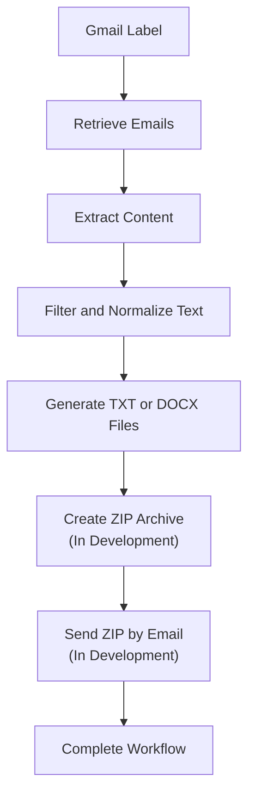

# Project Background

## Overview

The Email Automation project was created to reduce the manual effort required to process recruiter and job opportunity emails.

The workflow involves retrieving selected emails, extracting and filtering relevant content, generating output files, packaging the files, and delivering the completed results.

The Java Spring Boot application is an independent implementation of this automation process.

---

## Business Problem

Processing recruiter emails manually required several repetitive steps.

The process included:

- reviewing recruiter and job opportunity emails
- identifying relevant information
- cleaning unnecessary email content
- organizing the information
- creating individual files
- packaging the completed files
- preparing the results for delivery

Completing the process manually could take approximately 12 hours.

The purpose of the Email Automation project is to reduce this repetitive work while maintaining a consistent processing workflow.

---

## Original Python Solution

The first solution to the business problem was implemented in Python.

The Python application demonstrated that the workflow could be automated successfully and reduced the manual processing time from approximately 12 hours to about 90 minutes.

This established that automation could significantly reduce the amount of manual work required to process the recruiter emails.

---

## Java Spring Boot Solution

The Java Spring Boot application was later developed as a separate solution to the same business problem.

The Java application is not a direct translation of the Python source code.

Although both applications are intended to produce the same core processing outcomes, the Java implementation uses its own:

- architecture
- source code
- processing approach
- services
- configuration
- testing
- documentation

The Java application uses Java 17 and Spring Boot to organize the workflow around dedicated services with clearly separated responsibilities.

---

## Java Processing Goal

The Java application is designed to complete the recruiter-email workflow as one coordinated process.

The intended end-to-end flow is:

The application currently processes emails that the user has already placed in a designated Gmail label.

It does not automatically organize or move messages from the user's Inbox.

---

## Java Application Approach

The Java implementation uses Spring Boot services to separate the responsibilities required by the workflow.

Major responsibilities include:

- Gmail authentication
- Gmail email retrieval
- email content extraction
- text filtering and normalization
- TXT and DOCX file generation
- ZIP archive creation
- outbound email delivery
- workflow coordination

`EmailExportService` acts as the primary workflow orchestrator and coordinates the individual processing services.

This allows the application to maintain one end-to-end business workflow while keeping the implementation responsibilities separated internally.

---

## Current Development

The Java application currently supports the workflow through email retrieval, content processing, and TXT/DOCX file generation.

ZIP processing is currently being completed.

Outbound email delivery will complete the next stage of the end-to-end workflow.

After ZIP creation and outbound email delivery are working together, workflow reporting will be expanded so that the result of each major processing stage can be collected as the workflow runs and presented when processing is complete.

---

## Future Development

After the core Java workflow is completed, additional capabilities may be developed independently within the Java project.

Possible future enhancements include:

- React-based text filtering, preview, and user review
- security hardening and secure credential storage
- protected ZIP archives
- secure backup and recovery
- improved workflow reporting and monitoring
- additional email provider support

Detailed planned work is maintained in the [Roadmap](07-roadmap.md).

---

## Related Documentation

* [Architecture Overview](02-architecture-Overview.md)
* [Implementation Notes](03-implementation-notes.md)
* [API Endpoints](04-api-endpoints.md)
* [Setup and Run Guide](05-setup-and-run-guide.md)
* [Current Status](06-current-status.md)
* [Roadmap](07-roadmap.md)