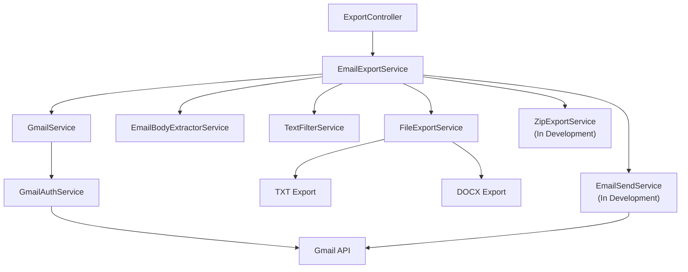
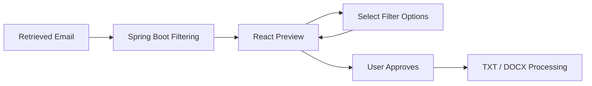

# Architecture Overview

## Overview

Email Automation is a Java 17 Spring Boot application that processes recruiter and job opportunity emails through the Gmail API.

The application uses a service-based backend architecture that separates Gmail authentication, email retrieval, content extraction, text filtering, file generation, ZIP processing, and outbound email responsibilities.

The current architecture is centered around a REST-driven workflow coordinated by Spring Boot services.

---

## Current Processing Flow



The current export workflow begins when a request is submitted to the export REST endpoint.

`EmailExportService` coordinates the main processing stages, while specialized services handle individual responsibilities.

---

## Project Structure

The active backend code is organized under:

```text
backend/
├── src/
│   ├── main/
│   │   ├── java/
│   │   │   └── com/example/email_automation/
│   │   │       ├── controller/
│   │   │       ├── dto/
│   │   │       ├── model/
│   │   │       ├── repository/
│   │   │       └── service/
│   │   └── resources/
│   └── test/
├── docs/
└── pom.xml
```

The application separates external API access, processing logic, file handling, and REST interaction into dedicated packages.

---

## Controller Layer

The controller layer exposes REST endpoints for interacting with the application.

Current controllers include:

* `HealthController`
* `GmailController`
* `ExportController`
* `EmailController`

### `HealthController`

Provides a basic application health endpoint.

### `GmailController`

Provides Gmail-related endpoints such as:

* Gmail connectivity validation
* retrieval of recent Gmail messages

### `ExportController`

Coordinates the user-facing export request.

The current controller:

1. receives the requested export format
2. calls `EmailExportService`
3. calls `EmailSendService`
4. records execution time
5. returns the workflow result

`EmailSendService` is currently under development.

---

## Gmail Authentication Layer

`GmailAuthService` is responsible for authenticating the application with Gmail.

Current responsibilities include:

* loading Gmail OAuth client credentials
* creating the Google OAuth authorization flow
* opening the local authorization callback
* storing authorization tokens locally
* building an authenticated Gmail API client

The service currently uses the Gmail read-only OAuth scope.

This authentication logic is kept separate from Gmail message retrieval.

---

## Gmail Service Layer

`GmailService` handles Gmail API operations after authentication has been established.

Current responsibilities include:

* validating Gmail connectivity
* retrieving Gmail account profile information
* retrieving messages from the configured processing label
* loading full Gmail message details

The current implementation retrieves messages from the `for_friend` Gmail label and limits the result set during development.

The application does not automatically organize or move messages from the user's Inbox.

---

## Email Content Extraction

`EmailBodyExtractorService` converts Gmail API message data into the application's internal email representation.

Current responsibilities include:

* subject extraction
* sender extraction
* received-date extraction
* email body extraction
* Gmail Base64 URL decoding
* MIME-part traversal
* received-date normalization

The service returns an `EmailMessage` object for later processing.

---

## Internal Email Model

The active export workflow uses the `EmailMessage` model.

`EmailMessage` currently contains:

* subject
* sender
* body
* received date

This internal model separates later processing stages from Gmail API-specific message objects.

The project also contains `GmailEmailDto`, which represents a broader DTO structure for Gmail-related data, but the current export workflow primarily uses `EmailMessage`.

---

## Text Processing

`TextFilterService` is responsible for cleaning and normalizing email content.

The current filtering pipeline performs operations such as:

* reply-marker removal
* multi-line content removal
* noise-line filtering
* Unicode cleanup
* whitespace normalization
* blank-line consolidation

The filtering logic remains separate from file generation so that processed content can be reused by different export formats.

---

## Export Orchestration

`EmailExportService` coordinates the main email-processing workflow.

The current sequence is:

1. validate the requested format
2. retrieve Gmail messages through `GmailService`
3. extract each message into an `EmailMessage`
4. clean the body using `TextFilterService`
5. save the processed email through `FileExportService`
6. track successful and failed file exports
7. call `ZipExportService`
8. generate an export summary

This service acts as the main workflow coordinator for the current backend implementation.

---

## File Export Layer

`FileExportService` handles local export generation.

Current supported formats are:

* TXT
* DOCX

Responsibilities include:

* validating email content
* determining the requested export format
* generating safe filenames
* preventing duplicate filename overwrites
* managing the configured output directory
* creating text headers
* generating DOCX content
* returning file-save success or failure

DOCX generation uses Apache POI.

---

## ZIP Processing

`ZipExportService` handles creation of ZIP archives containing the generated export files.

Current implementation includes:

* configurable source and destination directories
* destination-directory creation
* unique ZIP filename generation
* file-extension filtering
* ZIP entry creation
* copying exported files into the archive
* resource management using `try-with-resources`

ZIP processing is currently under development and is not yet considered complete as part of the full end-to-end workflow.

---

## Outbound Email

`EmailSendService` exists as the dedicated service for future outbound email delivery.

The current implementation is a placeholder and does not yet construct or send Gmail messages.

The intended responsibility of this service is to handle outbound delivery separately from Gmail retrieval and export processing.

Outbound email delivery remains under development.

---

## Persistence Layer

The project currently contains:

* `EmailModel`
* `EmailRepository`
* MySQL/JPA configuration

`EmailModel` is defined as a JPA entity, and `EmailRepository` extends `JpaRepository`.

However, database persistence is not currently integrated into the active email export workflow.

The persistence components represent groundwork for possible future tracking and storage capabilities.

---

## Supporting and Placeholder Components

The project also contains several classes that are not currently part of the primary workflow:

* `GmailEmailDto`
* `TextExportService`
* `BatchSendService`
* `EmailController`

These components reflect earlier development work or planned extension points.

The current primary workflow is centered around:

```text
ExportController
        ↓
EmailExportService
        ↓
GmailService
EmailBodyExtractorService
TextFilterService
FileExportService
ZipExportService
```

with outbound email support being developed through `EmailSendService`.

---

## Configuration

Application behavior is controlled through Spring Boot configuration.

Current custom configuration includes:

```properties
email.export.output-dir=processed_review
email.export.default-format=text
email.gmail.label=for_friend
email.zip.export-dir=ready_to_send
email.sent.folder.name=send_archive
```

The application also currently contains MySQL/JPA and logging configuration.

Configuration details are documented in the [Setup and Run Guide](05-setup-and-run-guide.md).

---

## Testing Architecture

The project currently uses:

* JUnit 5
* Mockito
* Spring Boot test support

Existing tests include:

* Spring application-context loading
* export workflow tests
* missing-format handling
* empty-email handling
* null-result handling
* successful export behavior with mocked dependencies

Additional representative test coverage is planned for important workflow boundaries.

---

## Planned Frontend Boundary

A React frontend is being considered as a future enhancement.

Its intended role is to provide an interactive review stage between email processing and permanent file generation.

The proposed interaction is:



Filter selections would affect the preview only until the user confirms the result.

Spring Boot would continue to own the filtering logic and file-processing workflow.

---

## Architectural Principles

The current Java implementation follows several design principles:

* separate authentication from Gmail operations
* separate Gmail API objects from internal processing models
* keep controllers focused on REST interaction
* place processing logic in dedicated services
* separate text filtering from file generation
* keep TXT and DOCX generation within a shared export service
* isolate ZIP creation from file generation
* isolate outbound email delivery from Gmail retrieval
* process only user-designated Gmail messages
* avoid automatically modifying the Inbox
* keep unfinished functionality clearly identified
* allow future components to be introduced without rewriting the entire processing flow

---

## Related Documentation

* [Project Background](01-project-background.md)
* [Implementation Notes](03-implementation-notes.md)
* [API Endpoints](04-api-endpoints.md)
* [Setup and Run Guide](05-setup-and-run-guide.md)
* [Current Status](06-current-status.md)
* [Roadmap](07-roadmap.md)
