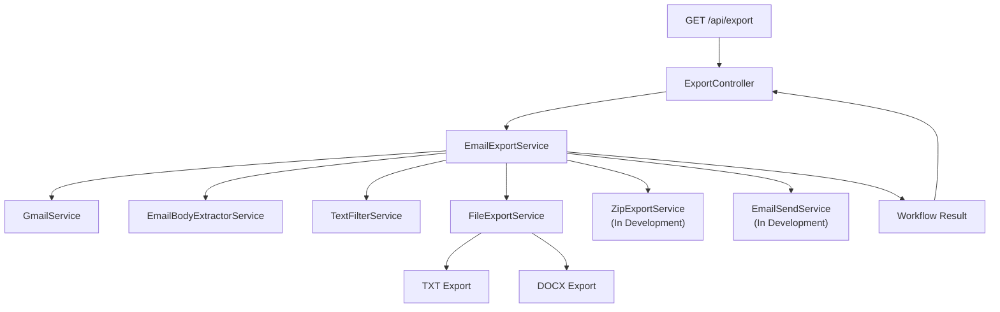

# API Endpoints

## Overview

This document describes the REST endpoints currently exposed by the Java Spring Boot Email Automation application.

The API provides endpoints for application health, Gmail connectivity, Gmail message retrieval, and the primary email automation workflow.

The application runs locally by default at:

```text
http://localhost:8080
```

---

## Health Check

```text
GET /api/health
```

Checks whether the Spring Boot application is running.

Example request:

```bash
curl http://localhost:8080/api/health
```

Example response:

```
Email Automation API is running
```

---

## Gmail Status

`GET /api/gmail/status`

Checks whether the application can authenticate and communicate with the Gmail API.

This endpoint uses the configured OAuth credentials and Gmail authentication flow.

Example request:

```bash
curl http://localhost:8080/api/gmail/status
```

The response contains the result of the Gmail connectivity check.

---

## Gmail Email Retrieval


`GET /api/gmail/emails`


Retrieves Gmail messages from the configured processing label.

Example request:

curl http://localhost:8080/api/gmail/emails

The current retrieval process includes:

- locating the configured Gmail label
- retrieving message IDs from the label
- loading the corresponding Gmail messages
- returning the retrieved message results

The application processes emails from a user-designated Gmail label and does not automatically organize or move messages from the user's Inbox.

This endpoint can be used independently to verify Gmail retrieval. The primary automation workflow also performs Gmail retrieval internally through `GmailService`.

---

## Export Workflow

`GET /api/export?format={format}`

Starts the primary end-to-end email automation workflow.

`ExportController` receives the request and delegates the processing workflow to `EmailExportService`.

`EmailExportService` acts as the workflow orchestrator and coordinates the services responsible for each processing stage.

### Supported Formats

Current supported format values are:

```text
text
word
```

### TXT Export Example

```bash
curl "http://localhost:8080/api/export?format=text"
```

### DOCX Export Example

```bash
curl "http://localhost:8080/api/export?format=word"
```

### Processing Flow

The workflow follows this sequence:

- Retrieve emails from the configured Gmail label
- Extract email content
- Filter and normalize the content
- Generate TXT or DOCX files
- Create the ZIP archive (in development)
- Send the ZIP archive by email (in development)
- Return the workflow result

The workflow is designed as a single processing sequence. Individual services handle specific responsibilities, while EmailExportService coordinates the overall flow.

ZIP processing and outbound email delivery are currently under development.

---

## Workflow Architecture

## Workflow Architecture



The individual processing services are internal components of the workflow and do not require separate public API endpoints.

---

## Current Endpoint Summary

| Method | Endpoint | Purpose |
| --- | --- | --- |
| GET | /api/health | Verify that the Spring Boot application is running |
| GET | /api/gmail/status | Verify Gmail authentication and connectivity |
| GET | /api/gmail/emails | Retrieve messages from the configured Gmail label |
| GET | /api/export?format=text | Run the primary workflow using TXT output |
| GET | /api/export?format=word | Run the primary workflow using DOCX output |

---

## Workflow Results

The export endpoint currently returns the result of the processing workflow.

The workflow result will continue to evolve as ZIP processing and outbound email delivery are completed.

A future reporting improvement will allow results from individual processing stages to be collected throughout the workflow and presented together when processing is complete.

The reporting implementation will be documented after the end-to-end workflow has been completed.

---

## HTTP Method Considerations

The current export workflow is initiated using an HTTP GET request.

Because the completed workflow creates files, creates a ZIP archive, and will send an outbound email, the export operation may be changed to an HTTP POST request in a future API revision.

The current endpoint remains documented as implemented.

Related Documentation
Project Background
Architecture Overview
Implementation Notes
Setup and Run Guide
Current Status
Roadmap

* [Project Background](01-project-background.md)
* [Architecture Overview](02-architecture-Overview.md)
* [Implementation Notes](03-implementation-notes.md)
* [Setup and Run Guide](05-setup-and-run-guide.md)
* [Current Status](06-current-status.md)
* [Roadmap](07-roadmap.md)