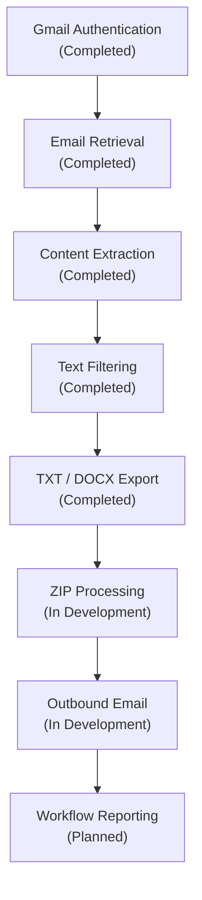

# Current Status

## Overview

This document describes the current implementation status of the Java Spring Boot Email Automation application.

Version 1 is intended to provide functionality equivalent to the original Python email automation program while using an independent Java Spring Boot architecture and implementation approach.

The Java application currently supports the workflow through email retrieval, content processing, and TXT/DOCX file generation.

ZIP processing and outbound email delivery are currently being completed.

---

## Version 1 Workflow Status



---

## Completed

### Spring Boot Backend

The Java backend is established using:

- Java 17
- Spring Boot
- Maven
- REST controllers
- service-based processing

The application can be built and run locally through Maven.

---

### Gmail OAuth Authentication

The application can authenticate with Gmail using OAuth 2.0.

Current authentication functionality includes:

- loading OAuth client credentials
- performing the Google authorization flow
- storing authorization tokens locally
- creating an authenticated Gmail API client

Authentication is handled separately from Gmail message-processing logic.

---

### Gmail Connectivity

The application can verify that it has successfully authenticated and connected to Gmail.

The Gmail status endpoint can be used to test connectivity independently from the complete export workflow.

---

### Gmail Label-Based Email Retrieval

The application retrieves emails from a configured Gmail label.

Current functionality includes:

- locating the configured Gmail label
- retrieving message IDs
- loading Gmail messages
- passing retrieved messages into the processing workflow

The application processes messages that the user has placed in the designated Gmail label.

It does not automatically organize or move messages from the user's Inbox.

---

### Email Content Extraction

The application extracts email information required by the processing workflow.

Current extraction includes:

- subject
- sender
- received date
- email body

Gmail message bodies are decoded and converted into readable content before filtering.

---

### Text Filtering and Normalization

Retrieved email content is processed through `TextFilterService`.

Current filtering handles email cleanup and normalization before the content is exported.

The filtering logic is kept separate from file generation so that the processed content can be used by multiple output formats.

---

### TXT Export

Processed emails can be exported as TXT files.

Current functionality includes:

- configurable output directory
- generated filenames
- duplicate filename handling
- processed email content
- file-save result tracking

---

### DOCX Export

Processed emails can also be exported as Microsoft Word DOCX files.

DOCX generation uses Apache POI.

The DOCX workflow uses the same processed email information while applying document-specific formatting and structure.

---

### Export Workflow Coordination

`EmailExportService` currently acts as the primary workflow orchestrator.

It coordinates the processing sequence by calling the services responsible for:

1. Gmail retrieval
2. email content extraction
3. text filtering
4. file generation
5. ZIP processing

Outbound email delivery will also be coordinated through this workflow when completed.

---

### Basic Workflow Results

The current export process tracks information such as:

- number of emails found
- number of files successfully saved
- number of failed file exports

The current reporting implementation will be expanded after ZIP processing and outbound email delivery are completed.

---

### Initial Automated Testing

JUnit 5 and Mockito have been introduced into the project.

Current testing includes representative coverage for:

- Spring Boot context loading
- missing export-format handling
- empty email results
- defensive null handling
- successful export workflow behavior
- mocked service dependencies

Expanded testing is planned for important workflow components rather than exhaustive testing of every method.

---

## In Development

### ZIP Processing

`ZipExportService` is currently being completed.

Current ZIP work includes:

- creating the destination directory when necessary
- generating a ZIP archive
- selecting generated files by export type
- adding matching files to the ZIP
- managing ZIP resources
- creating unique ZIP filenames

The ZIP functionality is not considered complete until it has been verified as part of the complete end-to-end workflow.

---

### Outbound Email Delivery

`EmailSendService` is being developed to send the completed ZIP archive.

The intended workflow is:

```text
Generated Files
      ↓
ZIP Archive
      ↓
EmailSendService
      ↓
Gmail
      ↓
Destination Email
```

Outbound email delivery will remain part of the primary export workflow rather than becoming a separate user-facing workflow.

---

## Planned Before Version 1 Completion

### Workflow Reporting

After ZIP creation and outbound email delivery are working, workflow reporting will be updated.

Rather than reconstructing the processing result only after everything has finished, the report will collect results as each major workflow stage completes.

The intended reporting information includes:

```text
Emails found
Files saved
Files failed
ZIP created
Email sent
Workflow completed
```

`EmailExportService` will coordinate the workflow and accumulate the results produced by each processing stage.

The completed report can then be returned at the end of the workflow and used for application output and logging.

This reporting design has not yet been implemented.

---

### Expanded Test Coverage

Additional representative automated tests are planned for important workflow boundaries.

Planned areas include:

- Gmail email retrieval
- text filtering
- file processing
- ZIP processing
- outbound email delivery

The goal is to demonstrate testing of the application's important behaviors and external integration boundaries rather than achieve exhaustive test coverage.

---

## Version 1 Completion Criteria

Version 1 will be considered functionally complete when the Java application can independently perform the complete email automation workflow:

```text
Retrieve Emails
      ↓
Extract Content
      ↓
Filter Content
      ↓
Generate TXT / DOCX
      ↓
Create ZIP
      ↓
Send ZIP by Email
      ↓
Return Completed Workflow Result
```

The Java implementation is intended to provide functionality equivalent to the original Python email automation program while retaining its own Java Spring Boot architecture and implementation approach.

---

## Outside Version 1 Scope

The following capabilities are not required to complete Version 1:

- React frontend
- interactive filter preview and selection
- advanced credential protection
- encrypted ZIP archives
- secure backup and recovery enhancements
- additional email provider support

These capabilities may be considered after the Version 1 Java workflow is complete.

They are documented separately in the [Roadmap](07-roadmap.md).

---

## Related Documentation

- [Project Background](01-project-background.md)
- [Architecture Overview](02-architecture-overview.md)
- [Implementation Notes](03-implementation-notes.md)
- [API Endpoints](04-api-endpoints.md)
- [Setup and Run Guide](05-setup-and-run-guide.md)
- [Roadmap](07-roadmap.md)