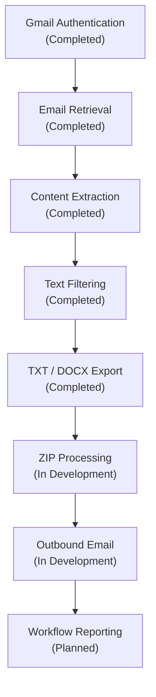
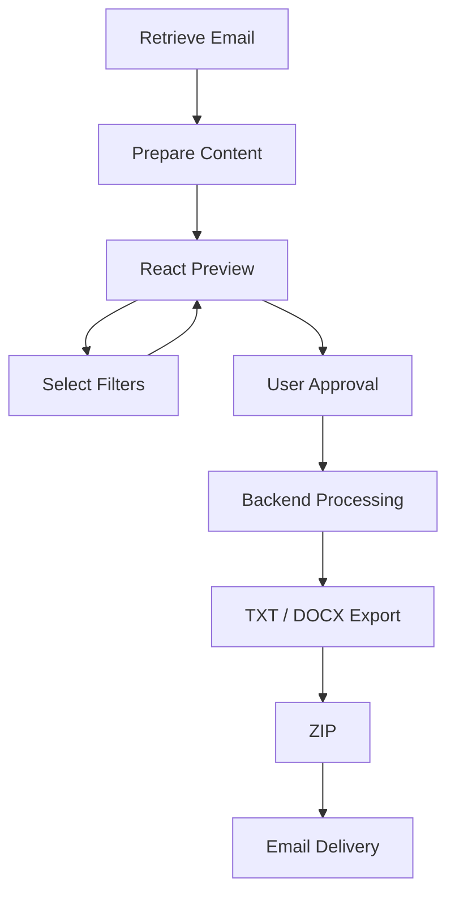

# Roadmap

## Overview

This document describes the planned development direction for the Java Spring Boot Email Automation project.

The immediate priority is to complete Version 1.

Version 1 is intended to provide functionality equivalent to the original Python email automation program while using an independent Java Spring Boot architecture and implementation approach.

Enhancements beyond that baseline will be considered only after the Version 1 workflow is complete.

---

## Version 1 Goal

Version 1 focuses on completing the end-to-end email automation workflow:



Version 1 will be considered functionally complete when this entire workflow can run successfully from beginning to end.

---

# Version 1 Remaining Work

## 1. Complete ZIP Processing

Complete and verify `ZipExportService` as part of the primary workflow.

Remaining work includes:

- verify generated files are correctly added to the ZIP archive
- verify TXT and DOCX workflows create the appropriate archives
- verify ZIP filenames and destination handling
- verify duplicate ZIP filename handling
- verify resource cleanup and error handling
- return the ZIP result to the remaining workflow

ZIP creation must work reliably before outbound email delivery is completed.

---

## 2. Complete Outbound Email Delivery

Complete `EmailSendService` and integrate it into the primary workflow.

The intended sequence is:

```text
File Export
    ↓
ZIP Creation
    ↓
EmailSendService
    ↓
Gmail API
    ↓
Destination Email
```

Planned work includes:

- use the existing Gmail authentication architecture
- create the outbound Gmail message
- configure the destination email address
- attach the generated ZIP archive
- send the message through Gmail
- detect successful or failed delivery attempts
- return the sending result to the workflow

`EmailExportService` will coordinate outbound delivery after ZIP creation succeeds.

---

## 3. Complete Workflow Reporting

After ZIP processing and outbound email delivery are working, workflow reporting will be redesigned to collect processing results as each major stage completes.

Rather than reconstructing the result after the entire workflow has finished, the workflow will accumulate results throughout processing.

The intended report includes:

```text
Emails found
Files saved
Files failed
ZIP created
Email sent
Workflow completed
```

Conceptually:

```text
Start Workflow
      ↓
Retrieve Emails
      ↓
Record Emails Found
      ↓
Generate Files
      ↓
Record Files Saved / Failed
      ↓
Create ZIP
      ↓
Record ZIP Result
      ↓
Send Email
      ↓
Record Email Result
      ↓
Determine Workflow Completion
      ↓
Return Final Report
```

This provides a single result representing the complete workflow while preserving the outcome of each major processing stage.

The same workflow result may later be used by application output, logging, and a future user interface.

---

## 4. Expand Representative Test Coverage

JUnit 5 and Mockito testing has already been introduced.

Additional tests are planned for important workflow components and integration boundaries.

Priority areas include:

- Gmail email retrieval
- text filtering
- file processing
- ZIP processing
- outbound email delivery
- complete workflow orchestration

The goal is not exhaustive testing of every method.

The goal is to provide representative tests for important application behavior and demonstrate appropriate testing approaches for business logic, filesystem operations, service interactions, and external API boundaries.

---

## 5. Version 1 Verification

After the remaining components are completed, the full workflow will be tested from beginning to end.

The final Version 1 verification should confirm:

- Gmail authentication succeeds
- emails are retrieved from the configured label
- email content is extracted correctly
- filtering produces the expected content
- TXT export works
- DOCX export works
- ZIP creation works
- the ZIP archive contains the expected files
- outbound email delivery works
- the ZIP attachment is delivered correctly
- workflow results accurately represent completed and failed stages
- failures do not incorrectly report the workflow as completed

After these requirements are verified, Version 1 can be considered functionally complete.

---

# Post-Version 1 Enhancements

The following capabilities are not required for Version 1.

They represent possible directions for continued development after the baseline Java workflow is complete.

---

## React Review Interface

A React frontend may be added to provide an interactive email review and filtering experience.

The proposed interface would allow the user to:

- preview extracted email content
- view available text filters
- enable or disable individual filters
- immediately preview how selected filters affect the displayed content
- approve the final result before permanent file processing continues

The preview would not directly modify the generated files.

The backend would perform the actual processing after the user confirms the desired filtering options.

A possible future flow is:



This would provide practical React experience while giving the frontend a meaningful role in the application rather than adding React solely for presentation.

---

## Security Hardening

Additional security protections may be introduced after the Version 1 workflow is complete.

Potential improvements include:

- stronger OAuth credential protection
- encrypted local secret storage
- operating-system credential storage
- Windows credential-management integration
- macOS Keychain integration
- integrity and tampering checks
- improved validation of external input
- protection against injection-related attacks
- review of sensitive logging
- secure configuration handling

Security improvements should protect credentials without preventing legitimate recovery when moving or restoring the application.

---

## Protected ZIP Archives

ZIP archive protection may be added after the baseline ZIP workflow is stable.

Potential capabilities include:

- encrypted ZIP archives
- secure password or key handling
- separation of the archive from its decryption information
- user-friendly archive recovery
- secure delivery of protected files

The security design should avoid storing the archive and its decryption secret together in an easily recoverable form.

---

## Credential Backup and Recovery

A secure backup and recovery process may be developed for sensitive application configuration.

The goal would be to protect against both:

- unauthorized access to credentials
- permanent loss of credentials after device failure or replacement

Potential approaches may include encrypted backup packages and operating-system protected credential storage.

Any recovery mechanism should be designed so that possession of the backup alone is insufficient to expose protected credentials.

---

## Additional Email Provider Support

Support for email providers other than Gmail may be considered in a future version.

Provider-specific integrations should remain separated from the application's internal processing logic so that the core filtering, export, ZIP, and reporting components do not depend directly on one email provider.

Additional provider support is not currently part of Version 1.

---

## Workflow Monitoring and History

Future versions may provide improved visibility into completed workflows.

Potential capabilities include:

- workflow execution history
- processing timestamps
- successful and failed stage tracking
- execution duration
- user-facing workflow status

The need and implementation approach for persistent workflow history will be evaluated only if this functionality becomes useful to a future version.

No database implementation is currently planned for Version 1.

---

# Future Development Principles

Future enhancements should follow several principles established by the Java implementation:

- preserve clear service responsibilities
- keep the primary business workflow understandable
- add functionality at the appropriate point in the workflow
- create separate workflows only when functionality represents a genuinely separate user operation
- avoid exposing internal services as API endpoints without a user-facing reason
- keep external integrations separated from internal processing logic
- maintain user control over Gmail messages
- avoid automatically modifying the user's Inbox
- keep security and recovery requirements balanced
- document functionality as completed only after it has been implemented and verified

---

# Documentation After Version 1

After Version 1 is complete:

- `Current Status` can be removed
- the README can identify Version 1 as complete
- the Architecture Overview can describe the completed workflow without development-status labels
- the API documentation can describe the final workflow response
- the Setup and Run Guide can describe the completed outbound-email configuration
- this Roadmap can be updated to focus entirely on post-Version 1 development

Git history will continue to provide the detailed chronological record of how the application developed.

---

## Related Documentation

- [Project Background](01-project-background.md)
- [Architecture Overview](02-architecture-overview.md)
- [Implementation Notes](03-implementation-notes.md)
- [API Endpoints](04-api-endpoints.md)
- [Setup and Run Guide](05-setup-and-run-guide.md)
- [Current Status](06-current-status.md)